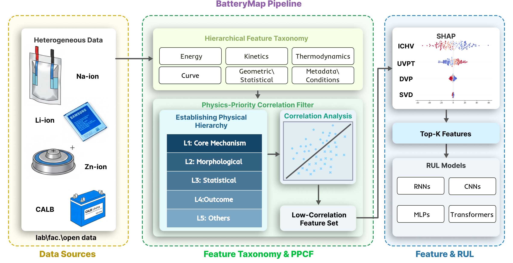

# BatteryMap: Structuring Physics-Informed Feature Space for Robust Early Remaining Useful Life Prediction

BatteryMap is a modular platform for battery lifecycle analysis, combining feature extraction, PPCF-related feature engineering and deep learning based early remaining useful life prediction.




## Current Capabilities

- Multi-dataset feature extraction (Energy, Kinetics, Thermodynamics, Curve, Geometric, Metadata & Conditions)
- PPCF-related feature engineering pipeline (cleaning, imputation, filter selection, wrapper selection)
- Deep learning training and evaluation for battery early remaining useful life prediction

## Project Structure

```text
BatteryMap/
├─ run.py                          # Unified command entry
├─ run_feature_extraction.py       # Feature extraction entry
├─ run_feature_selection.py        # Feature engineering entry (PPCF-related code and descriptions are here)
├─ run_main.py                     # Training and evaluation entry
├─ features/                       # Dataset-specific extraction scripts and base extractor
├─ modules/
│  ├─ data_processor/              # Cleaning, imputation, loading
│  ├─ feature_selector/            # Filter and wrapper selectors
│  └─ predictor/                   # Trainer, evaluator, model factory
├─ data_provider/                  # Data loading and split records
├─ models/                         # Model implementations
├─ scripts/                        # Optimization, evaluation, and batch scripts
├─ configs/                        # Best hyperparameters and search spaces
└─ docs/                           # Detailed documentation
```

## Rebuttal Results
### Table S1: 4 Batteries Best-MAPE for Feature Selection Sentivity Analysis

> Addresses: R1-Q3 (missing standard feature selection baselines), R2-Q1 (missing LASSO and other standard baselines)

| Method | Li-ion | CALB | Na-ion | Zn-ion | 4-Group Average |
|:------|-------:|-----:|-------:|-------:|---------------:|
| **BatteryMap** | **0.1580** | **0.1270** | 0.2320 | **0.2360** | **0.1883** |
| LASSO | 0.1590 | 0.1765 | **0.2213** | 0.3123 | 0.2173 |
| PCF | 0.1615 | 0.1344 | 0.2869 | 0.4368 | 0.2549 |
| Swap L1↔L2 | 0.1641 | 0.1344 | 0.2700 | 0.4329 | 0.2504 |
| Swap L1↔L3 | 0.1621 | 0.1344 | 0.2794 | 0.4329 | 0.2522 |
| Swap L1↔L4 | 0.1636 | 0.1344 | 0.3011 | 0.4329 | 0.2580 |
| Swap L1↔L5 | 0.1635 | **0.1133** | 0.3011 | 0.4329 | 0.2527 |

> **Key Finding**: BatteryMap achieves the lowest average best-MAPE across the four chemistry groups (0.1883), performing best on Li-ion and Zn-ion, and second only to swap_l1l5 on CALB by a single local optimum. LASSO slightly outperforms on Na-ion (margin: 0.0107), but this gain relies on L4 outcome feature bias (see S9 for data leakage evidence), and LASSO is significantly worse than BatteryMap on CALB (0.1765 vs 0.1270).

### Table S2: Macro Jaccard Metrics for Different Feature Selection Methods

> Addresses: R2-Q2 (hierarchy assignment sensitivity), R4-Q1 (theoretical/empirical basis for L1–L5 hierarchies)

| Method | Avg Jaccard | Avg Overlap Rate | Avg Common Features | Difference Level |
|:------|------------:|-----------------:|-------------------:|:----------------:|
| PCF | **0.746** | 0.829 | 17.4 | Very Small |
| Swap L1-L5 | 0.685 | 0.784 | 16.5 | Moderate |
| Swap L1-L2 | 0.681 | 0.781 | 16.4 | Moderate |
| Swap L1-L4 | 0.677 | 0.778 | 16.3 | Moderate |
| Swap L1-L3 | **0.669** | 0.771 | 16.2 | Moderate |
| LASSO | **0.350** | 0.502 | 10.5 | Large |

> **Key Finding**: The fine-tuning stage (replacing SHAP with LASSO) has far greater impact on the feature set than the coarse-filtering stage (priority swapping). LASSO retains only ~50% of original features on average (Jaccard=0.350), while all PPCF Swap variants maintain Jaccard >= 0.669. Swap L1-L3 has the largest impact (Jaccard=0.669), indicating that downgrading L3 statistical features is the most critical design choice in the original physical priority framework.

### Table S3: BatteryLife CP Series Computational Efficiency (4-Dataset Average)

> Addresses: R3-Q1 (runtime and resource overhead), R4-Q3 (computational efficiency)

| Algorithm | Parameters | FLOPs | Avg Train Time (s) | Avg Test Time (s) |
|:----------|----------:|------:|-------------------:|------------------:|
| **— BatteryLife —** | | | | |
| CPMLP | 2,151,041 | **635.4** | **46.9** | 10.0 |
| CPGRU | 1,993,345 | 6,259.1 | 161.3 | 11.5 |
| CPLSTM | 759,809 | 1,195.0 | 215.8 | 14.2 |
| CPBiGRU | 6,665,665 | 10,173.8 | 1,084.7 | 47.8 |
| CPBiLSTM | **701,953** | 2,220.2 | 158.1 | 11.5 |
| CPTransformer | 922,241 | 1,452.6 | 59.2 | **9.7** |
| **— BatteryMap —** | | | | |
| MLP | 556,865 | **16.3** | **595.0** | **3.8** |
| GRU | 1,703,422 | 5,213.6 | 1,496.9 | **4.8** |
| LSTM |     705861 | 1,984.5 | 1,692.8 | 5.3 |
| Transformer | **418,381** | 1,290.3 | 1,785.0 | 5.3 |

### Table S4: SHAP Cumulative Contribution Inflection Points k90/k95

> Addresses: R3-Q2 (rationale for Top-20 threshold)

| Dataset | k90 | k95 | Top20 SHAP Sum |
|:--------|----:|----:|---------------:|
| Li-ion | 10.17 | 13.83 | — |
| ZN-ion | 13 | 16 | 479.75 |
| NA-ion | 12 | 15 | 76.19 |
| CALB | 3 | 7 | 558.81 |


> **Key Finding**: The 12 primary datasets average k90=10.17 and k95=13.83, indicating that Top-20 is a conservative truncation point covering >=95% SHAP contribution, not an arbitrary setting. ZN-ion (k90=13, k95=16), NA-ion (k90=12, k95=15), and CALB (k90=3, k95=7) follow similar patterns, with CALB showing extreme concentration where only 3 features contribute >=90% of SHAP importance.


## Quick Start

Run feature extraction:

```bash
python run_feature_extraction.py
```

Run feature selection:

```bash
python run_feature_selection.py --dataset_id HUST
```

Run model training:

```bash
python run_main.py --model Autoformer --dataset HUST
```

Or use the unified entry:

```bash
python run.py extraction
python run.py selection --dataset_id HUST
python run.py predict --model Autoformer --dataset HUST
```